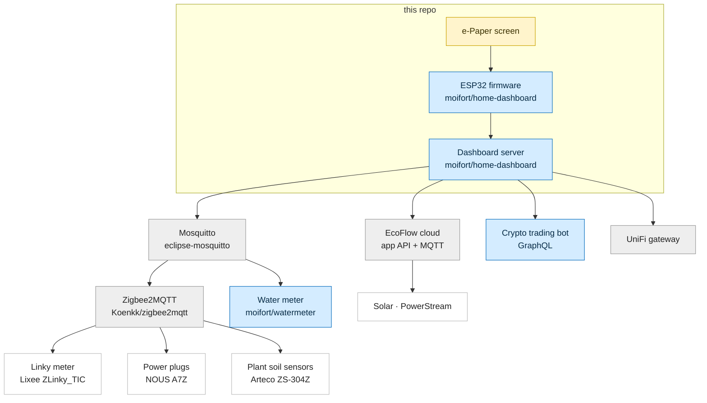

# Home Assistant e-Paper Dashboard

<p align="center">
  
</p>
<p align="center">
  
</p>

E-paper screen for the home. It reads your smart-home data and renders: electricity, solar, water, plants and network. A small ESP32 wakes on a timer, pulls the ready-made image from a server you host yourself, then goes back to sleep. No backlight, barely any power.


## Features

| Panel | What you see |
|-------|--------------|
| **Electricity** (core) | Last 9 days + live of consumption as stacked off-peak/peak bars. Three headline stats (`kWh/j` daily average, `HC %` off-peak share, `€/j` daily cost), each with a 4-week trend. |
| **Plugs & baseline power** | One row per power sensor you add (water heater, washing machine...) with its daily kWh and off-peak share, plus the home's permanent standby draw in watts. |
| **Solar** | Daily solar production from an EcoFlow PowerStream: average, period total and money saved. |
| **Water** | Daily water use in litres from an MQTT water meter, with month-to-date m³ and its cost. |
| **Plants** | One card per soil sensor: moisture, temperature, light, the time since its last reading, a 10-day trend on moisture data, and a water-drop icon when moisture drops below your threshold. |
| **Crypto** | A trading-bot stats banner (return %, profit, portfolio) with a price-grid snapshot. |
| **Network** | UniFi internet & Wi-Fi quality, latency, data usage and top clients. |
| **Device battery** | Estimated charge % and days since the ESP32 was last charged, in the `Home` panel, with average/record autonomy on `/status` — inferred from the device's boot telemetry, no extra sensor. |
| **Alerts**  | Notes flagging a smart alerts, a probable leak, or a disconnect, each with its €/day impact. |

## Hardware

| Component | Reference | Price |
|-----------|-----------|-----------|
| e-Paper display | [Waveshare 10.85" (G) 4-color](https://www.waveshare.com/10.85inch-e-paper-hat-plus.htm) | 98,39€ |
| Microcontroller | [Seeed XIAO ESP32-S3](https://www.seeedstudio.com/XIAO-ESP32S3-p-5627.html) | 15,59€ |
| Electricity meter reader | [Lixee ZLinky_TIC V2](https://lixee.fr/fr/produits/42-zlinky-tic-v2-3770014375179.html) | 49€ |
| Power plugs | [NOUS A7Z](https://amzn.to/4evpkKK): Zigbee 16 A plug with energy monitoring (Z2M model `TS011F` / `_TZ3008_reatplte`) | 10€ |
| Plant soil sensors | [Arteco ZS-304Z](https://fr.aliexpress.com/item/1005010441104606.html): Zigbee soil sensor (moisture / temp / light) | 5€ |
| Server | Any Docker host (CasaOS, Raspberry Pi, a NAS) | – |
| 3D printed case | [Dashboard.3mf](hardware/case/Dashboard.3mf): matte PLA, 15% infill, no supports | – |

## Installation

### 1. Read your electricity meter

The dashboard reads the meter's teleinfo locally over MQTT. No cloud API, no token:

1. Plug a [Lixee ZLinky_TIC](https://lixee.fr/fr/produits/42-zlinky-tic-v2-3770014375179.html) into your Linky meter's **TIC connector** (the I1/I2 terminals under the green cover).
2. Pair it in **Zigbee2MQTT** and note its topic (e.g. `zigbee2mqtt/linky`).

It expects an HC/HP (off-peak/peak) contract. History builds up from the first connection, so a day the server is down stays blank.

### 2. Configure

```bash
cp server/.env.example server/.env
```

Required settings in `server/.env`:

```env
# The local MQTT broker Zigbee2MQTT publishes to (LAN IP, not localhost)
MQTT_HOST=192.168.1.50
MQTT_PORT=1883
MQTT_USERNAME=                       # omit if the broker is anonymous
MQTT_PASSWORD=

# The ZLinky_TIC topic in Zigbee2MQTT
LINKY_MQTT_TOPIC=zigbee2mqtt/linky

# Your contract pricing (€/kWh, €/month)
PRICE_HP=0.2065
PRICE_HC=0.1579
PRICE_ABO_MONTHLY=15.65

# Refresh schedule. The ESP32 wakes every N minutes, must match the firmware.
SCREEN_REFRESH_INTERVAL_MIN=120
```

Then add any optional panels below ([.env.example](server/.env.example) lists every variable, including the fine-tuning ones).

<details>
<summary><b>Solar (EcoFlow PowerStream)</b></summary>

Shows daily solar production above the consumption chart. The server reads the inverter's PV power from EcoFlow's app MQTT broker and integrates it into daily kWh.

```env
ECOFLOW_EMAIL=your_ecoflow_account_email
ECOFLOW_PASSWORD=your_ecoflow_account_password
ECOFLOW_DEVICE_SN=your_powerstream_serial_number
ECOFLOW_API_HOST=api-e.ecoflow.com   # EU; api.ecoflow.com (global) / api-a.ecoflow.com (asia)
```
</details>

<details>
<summary><b>Water meter</b></summary>

An ESPHome wM-Bus reader publishes the meter's cumulative index (m³) to MQTT, and the dashboard derives daily litres by index difference. Set the price to show the monthly cost.

```env
WATER_TOPIC=watermeter/index_m3        # cumulative index in m³ (raw float payload)
WATER_PRICE_M3=4.30                    # €/m³ (0 = hide cost)
```
</details>

<details>
<summary><b>Power sensors (Cumulus, washing machine)</b></summary>

Any Zigbee2MQTT / ESPHome device reporting only instantaneous power (W). Each becomes a row in the bottom table, integrated into daily kWh. Declare them all in one variable as `topic:Display Name`, `;`-separated. Topics sharing the same label get summed into one row (e.g. every plug in a `Salon`).

```env
POWER_SENSORS=zigbee2mqtt/cumulus:Cumulus;zigbee2mqtt/washing_machine:Lave-linge
```
</details>

<details>
<summary><b>Plant soil sensors</b></summary>

Any Zigbee2MQTT soil sensor reporting `soil_moisture`, `temperature` and `illuminance`. Each becomes a `Plantes` card. The format is `topic:Display Name:threshold`, where the trailing number is the watering threshold (soil-moisture %): the water-drop icon shows when moisture drops below it. A plant without its own threshold falls back to `PLANTS_MOISTURE_THRESHOLD`. These sensors report rarely (battery), so enabling `retain` on the device in Zigbee2MQTT is recommended: a server restart then repopulates the cards immediately instead of waiting for the next wake-up.

```env
PLANTS_SENSORS=zigbee2mqtt/ficus:Ficus:30;zigbee2mqtt/basilic:Basilic:40
PLANTS_MOISTURE_THRESHOLD=30           # global fallback (%); empty = no drop without a per-plant value
```
</details>

<details>
<summary><b>Crypto-bot stats</b></summary>

Point the dashboard at your crypto-bot's GraphQL endpoint to show its trading stats top-right. Use the bot's LAN IP (not `localhost`) when both run on the same host.

```env
CRYPTO_API_URL=http://192.168.1.50:3003/graphql
CRYPTO_API_TOKEN=your_crypto_bot_api_token   # omit if no auth
```
</details>

<details>
<summary><b>UniFi network panel</b></summary>

Point the dashboard at your local UniFi gateway (UCG/UDM on UniFi OS) for a `Réseau` panel with internet & Wi-Fi quality, per-SSID client counts and top consumers. It logs in with your local gateway account. Set your SSID names so the IoT vs main split is correct.

```env
UNIFI_HOST=https://192.168.1.1
UNIFI_USERNAME=your_gateway_local_account
UNIFI_PASSWORD=your_gateway_password
UNIFI_SITE=default
UNIFI_SSID_IOT=your_iot_wifi_ssid
UNIFI_SSID_MAIN=your_main_wifi_ssid
```
</details>

<details>
<summary><b>ESP32 battery autonomy</b></summary>

The `Home` panel shows an estimated remaining charge with the days since the last charge in parens (`Batt. 22% (4j)`), with average and record autonomy on `/status`. No extra sensor: the firmware reports its boot count and reset reason on each `/display` pull, and the server bounds each charge cycle on power-on events (power restored after a recharge or a flat battery). The % is derived from the cycle timing — the longest completed run is taken as a full charge, and the share of it not yet elapsed on the current run is the charge left — so it sharpens as more cycles accumulate; until a full cycle is on record the line shows days alone (`Batt. 4j`). On by default; set `BATTERY_MONITOR=false` to disable. The autonomy is most meaningful over a full discharge cycle (charge → flat → recharge); a top-up while the device is still running leaves no power-on signal. Reflash the firmware to start sending the telemetry.

```env
BATTERY_MONITOR=true                   # set false to disable the Home battery line
```
</details>

### 3. Run the server

**Docker Compose:**

```bash
curl -O https://raw.githubusercontent.com/moifort/home-dashboard/main/server/docker-compose.yml
docker compose up -d
```

**CasaOS:** import this compose file from the CasaOS interface:

```
https://raw.githubusercontent.com/moifort/home-dashboard/main/server/docker-compose.casaos.yml
```

The dashboard is then at `http://your-server:5000`.

### 4. Flash & set up the ESP32

Requires [Arduino CLI](https://arduino.github.io/arduino-cli/) with the `esp32:esp32` core:

```bash
brew install arduino-cli
arduino-cli core install esp32:esp32

arduino-cli compile --fqbn "esp32:esp32:XIAO_ESP32S3:PSRAM=opi" hardware/esp32-display/
arduino-cli upload  --fqbn "esp32:esp32:XIAO_ESP32S3:PSRAM=opi" --port /dev/cu.usbmodem101 hardware/esp32-display/
```

On first boot, open the serial monitor and follow the prompts for Wi-Fi and the server URL:

```bash
arduino-cli monitor --port /dev/cu.usbmodem101 --config baudrate=115200
```

To reconfigure later, type `reset` within 3 seconds of boot. The ESP32 then wakes on a clock-aligned interval (`REFRESH_INTERVAL_MIN`, default 120 min), refreshes the screen, and deep-sleeps until the next boundary. A failed cycle just retries with backoff.

## Architecture

The ESP32 drives the screen and pulls a ready-made image from the server. The server does the actual work: it talks to your LAN devices and to the EcoFlow cloud for solar.



## Endpoints

| Method | Path | Description |
|--------|------|-------------|
| `GET` | `/display` | EPD binary buffer (163,200 bytes), rendered fresh, for the ESP32 (also records the device's battery telemetry from its query params) |
| `GET` | `/` | Auto-refreshing HTML preview in a browser |
| `GET` | `/preview.png` | The dashboard rendered as a PNG |
| `GET` | `/status` | Server status as JSON (last render, day count, per-domain config) |
| `GET` | `/api/data` | The full render data as JSON (debug) |

## License

DWTFYW
