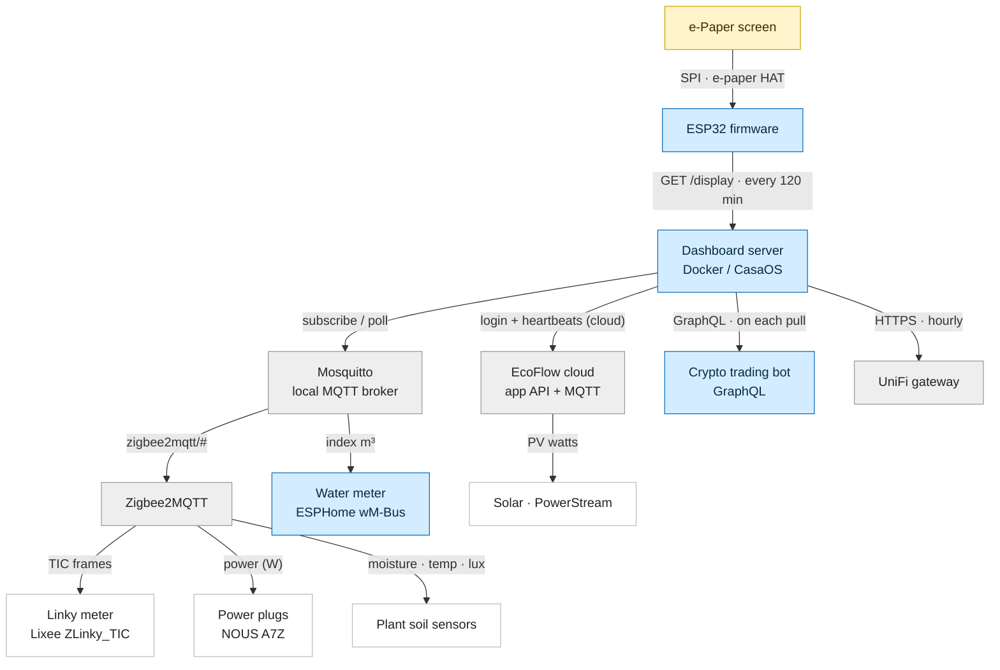

# Home Assistant e-Paper Dashboard

<p align="center">
  
</p>

An always-on e-paper screen for your home. It reads your smart-home data straight from **MQTT** — the broker your **Zigbee2MQTT / Home Assistant** setup already uses — and renders one clean dashboard: electricity, solar, water, plants and network. A small ESP32 wakes on a schedule, pulls the rendered image from a server you self-host, then goes back to sleep — so it sips power and never needs a backlight.

<p align="center">
  
</p>

## Architecture

The ESP32 drives the e-paper screen and pulls a freshly rendered image from the
server; the server gathers everything from your LAN (and the EcoFlow cloud for
solar). Blue nodes are this project's own repos.



**This project's repos** (blue): the **server + ESP32 firmware**
([moifort/home-dashboard](https://github.com/moifort/home-dashboard)), the
**water meter** ESPHome config
([moifort/watermeter](https://github.com/moifort/watermeter)), and the **crypto
trading bot** (own project). Everything else — Mosquitto, Zigbee2MQTT, EcoFlow,
UniFi and the physical meters/plugs — is third-party.

> Arrows show who connects to whom. Over MQTT the devices actually *push* their
> readings to Mosquitto and the server subscribes (power plugs and EcoFlow are
> also re-polled every 60 s).

## What it shows

Electricity is the core panel; everything else is **optional** and turns on as soon as you set its config.

| Panel | What you see |
|-------|--------------|
| **Electricity** (core) | Last 9 days of consumption as stacked **off-peak/peak** bars, plus a live `Auj.` (today) bar. Three headline stats — `kWh/j` (daily average), `HC %` (off-peak share), `€/j` (daily cost) — each with a 4-week trend. |
| **Talon** (baseline power) | A table of the home's permanent standby draw (fridge, internet box…) in watts, with a row per power sensor you add. |
| **Solaire** (Solar) | Daily solar production from an EcoFlow PowerStream — average, period total and money saved. |
| **Eau** (Water) | Daily water use in litres from an MQTT water meter, with month-to-date m³ and its cost. |
| **Plantes** (Plants) | One card per soil sensor: moisture, temperature, light, a 7-day trend, and a **water-drop** icon when moisture drops below your threshold. |
| **Crypto** | A trading-bot stats banner (return %, profit, portfolio) with a price-grid snapshot. |
| **Réseau** (Network) | UniFi internet & Wi-Fi quality, latency, data usage and top clients. |
| **Alertes** (Alerts) | Plain-language notes (shown in French) flagging a sharp rise, a probable leak, a disconnect… each with its **€/day impact**. |

Every chart has an `Auj.` (today) bar that grows through the day, and a mini **intraday strip** under each bar showing *how* the day was spent. There's no minimum threshold — every real reading counts; a day with no data shows `N/A`. History starts the day you connect each source (no backfill).

## Hardware

| Component | Reference |
|-----------|-----------|
| e-Paper display | [Waveshare 10.85" (G) 4-color](https://www.waveshare.com/10.85inch-e-paper-hat-plus.htm) |
| Microcontroller | [Seeed XIAO ESP32-S3](https://www.seeedstudio.com/XIAO-ESP32S3-p-5627.html) |
| Electricity meter reader | [Lixee ZLinky_TIC V2](https://lixee.fr/fr/produits/42-zlinky-tic-v2-3770014375179.html) |
| Power plugs | [NOUS A7Z](https://amzn.to/4evpkKK) — Zigbee 16 A plug with energy monitoring |
| Plant soil sensors | [Zigbee soil sensor](https://fr.aliexpress.com/item/1005010441104606.html?spm=a2g0o.order_list.order_list_main.22.566f5e5bBjWddT&gatewayAdapt=glo2fra) (moisture / temp / light) |
| Server | Any Docker host (CasaOS, Raspberry Pi, NAS…) |
| 3D printed case | [Dashboard.3mf](hardware/case/Dashboard.3mf) — matte PLA recommended |

## Installation

### 1. Read your electricity meter

The dashboard reads the meter's teleinfo **locally** over MQTT — no cloud API, no token:

1. Plug a [Lixee ZLinky_TIC](https://lixee.fr/produits/30-zlinky-tic-3770014375070.html) into your Linky meter's **TIC connector** (the I1/I2 terminals under the green cover).
2. Pair it in **Zigbee2MQTT** and note its topic (e.g. `zigbee2mqtt/linky`).

It expects an **HC/HP** (off-peak/peak) contract. History accumulates from the first connection — a day the server is down stays blank.

### 2. Configure

```bash
cp server/.env.example server/.env
```

Required settings in `server/.env`:

```env
# The local MQTT broker Zigbee2MQTT publishes to (LAN IP, not localhost)
MQTT_HOST=192.168.1.50
MQTT_PORT=1883
MQTT_USERNAME=                       # omit if the broker is anonymous
MQTT_PASSWORD=

# The ZLinky_TIC topic in Zigbee2MQTT
LINKY_MQTT_TOPIC=zigbee2mqtt/linky

# Your contract pricing (€/kWh, €/month)
PRICE_HP=0.2065
PRICE_HC=0.1579
PRICE_ABO_MONTHLY=15.65

# Refresh schedule — the ESP32 wakes every N minutes (must match the firmware).
SCREEN_REFRESH_INTERVAL_MIN=120
DATA_LEAD_MIN=10
INTRADAY_MAX_W=3000                  # intraday strip scale (W at full height)
```

Then add any **optional panels** below.

<details>
<summary><b>Solar — EcoFlow PowerStream</b></summary>

Shows daily solar production above the consumption chart. The server reads the inverter's PV power from EcoFlow's app MQTT broker and integrates it into daily kWh.

```env
ECOFLOW_EMAIL=your_ecoflow_account_email
ECOFLOW_PASSWORD=your_ecoflow_account_password
ECOFLOW_DEVICE_SN=your_powerstream_serial_number
ECOFLOW_API_HOST=api-e.ecoflow.com   # EU; api.ecoflow.com (global) / api-a.ecoflow.com (asia)
INTRADAY_SOLAR_MAX_W=800             # intraday strip scale (W at full height)
```
</details>

<details>
<summary><b>Water meter</b></summary>

An ESPHome wM-Bus reader publishes the meter's **cumulative index (m³)** to MQTT; the dashboard derives daily litres by index difference. Set the price to show the monthly cost.

```env
WATER_TOPIC=watermeter/index_m3        # cumulative index in m³ (raw float payload)
WATER_PRICE_M3=4.30                    # €/m³ (0 = hide cost)
INTRADAY_WATER_MAX_L=150               # intraday strip scale (L per 4h bucket)
```
</details>

<details>
<summary><b>Power sensors (Cumulus, washing machine…)</b></summary>

Any Zigbee2MQTT / ESPHome device reporting only **instantaneous power** (W). Each becomes a row in the bottom table, integrated into daily kWh. Declare them all in one variable — `topic:Display Name`, `;`-separated. Topics sharing the **same label** are summed into one row (e.g. every plug in a `Salon`).

```env
POWER_SENSORS=zigbee2mqtt/cumulus:Cumulus;zigbee2mqtt/washing_machine:Lave-linge
```
</details>

<details>
<summary><b>Plant soil sensors</b></summary>

Any Zigbee2MQTT soil sensor reporting `soil_moisture`, `temperature` and `illuminance`. Each becomes a `Plantes` card. The format is `topic:Display Name:threshold` — the trailing number is the **watering threshold** (soil-moisture %); the water-drop icon shows when moisture drops below it. A plant without its own threshold falls back to `PLANTS_MOISTURE_THRESHOLD`.

```env
PLANTS_SENSORS=zigbee2mqtt/ficus:Ficus:30;zigbee2mqtt/basilic:Basilic:40
PLANTS_MOISTURE_THRESHOLD=30           # global fallback (%); empty = no drop without a per-plant value
```
</details>

<details>
<summary><b>Crypto-bot stats</b></summary>

Point the dashboard at your crypto-bot's GraphQL endpoint to show its trading stats top-right. Use the bot's **LAN IP** (not `localhost`) when both run on the same host.

```env
CRYPTO_API_URL=http://192.168.1.50:3003/graphql
CRYPTO_API_TOKEN=your_crypto_bot_api_token   # omit if no auth
```
</details>

<details>
<summary><b>UniFi network panel</b></summary>

Point the dashboard at your local UniFi gateway (UCG/UDM on UniFi OS) for a `Réseau` panel with internet & Wi-Fi quality, per-SSID client counts and top consumers. It logs in with your **local** gateway account. Set your SSID names so the IoT vs main split is correct.

```env
UNIFI_HOST=https://192.168.1.1
UNIFI_USERNAME=your_gateway_local_account
UNIFI_PASSWORD=your_gateway_password
UNIFI_SITE=default
UNIFI_SSID_IOT=your_iot_wifi_ssid
UNIFI_SSID_MAIN=your_main_wifi_ssid
```
</details>

### 3. Run the server

**Docker Compose:**

```bash
curl -O https://raw.githubusercontent.com/moifort/dashboard/main/server/docker-compose.yml
docker compose up -d
```

**CasaOS** — import this compose file from the CasaOS interface:

```
https://raw.githubusercontent.com/moifort/dashboard/main/server/docker-compose.casaos.yml
```

The dashboard is then at `http://your-server:5000`.

### 4. Flash & set up the ESP32

Requires [Arduino CLI](https://arduino.github.io/arduino-cli/) with the `esp32:esp32` core:

```bash
brew install arduino-cli
arduino-cli core install esp32:esp32

arduino-cli compile --fqbn "esp32:esp32:XIAO_ESP32S3:PSRAM=opi" hardware/esp32-display/
arduino-cli upload  --fqbn "esp32:esp32:XIAO_ESP32S3:PSRAM=opi" --port /dev/cu.usbmodem101 hardware/esp32-display/
```

On first boot, open the serial monitor and follow the prompts for **Wi-Fi** and the **server URL**:

```bash
arduino-cli monitor --port /dev/cu.usbmodem101 --config baudrate=115200
```

To reconfigure later, type `reset` within 3 seconds of boot. The ESP32 then wakes on a clock-aligned interval (`REFRESH_INTERVAL_MIN`, default **120 min**), refreshes the screen, and deep-sleeps until the next boundary — retrying with backoff on a failed cycle.

## Endpoints

| Method | Path | Description |
|--------|------|-------------|
| `GET` | `/display` | EPD binary buffer (163,200 bytes), rendered fresh — for the ESP32 |
| `GET` | `/` | Auto-refreshing HTML preview in a browser |
| `GET` | `/preview.png` | The dashboard rendered as a PNG |
| `GET` | `/status` | Server status as JSON (last render, day count, per-domain config) |

## Development

A golden-master test suite guards the render pipeline: it freezes a known input (a seeded DB + a fixed clock) and compares the output byte-for-byte to committed references — both the data (`data.golden.json`) and the rendered EPD buffer (`display.golden.bin`).

```bash
cd server
pip install -r requirements-dev.txt
pytest -q                  # must stay green: nothing changed
pytest -q --update-golden  # re-baseline after an intentional layout/data change
```

On a render mismatch the actual/golden/diff PNGs are written to `/tmp`. CI runs the suite on every push and PR. The render golden depends on the FreeType/Pillow build (so it's generated locally and checked strictly there, smoke-tested in CI); the data golden is byte-exact everywhere.

## 3D printed case

[Dashboard.3mf](hardware/case/Dashboard.3mf) — matte PLA, 15% infill, no supports.

## License

MIT
