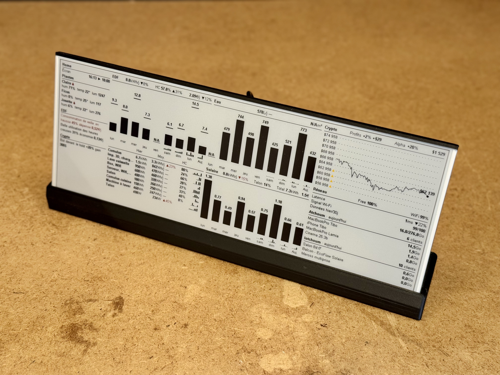
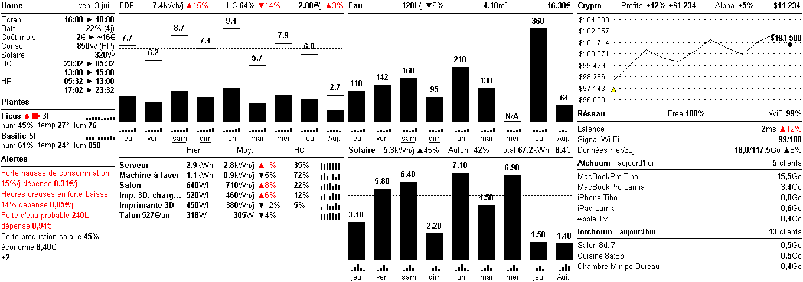

# Linky e-Paper Dashboard

<p align="center">
  
</p>

Monitor your electricity consumption from a Linky smart meter — read locally by a **Lixee ZLinky_TIC** Zigbee dongle through Zigbee2MQTT — on an e-paper display. The dashboard shows the last 9 days of consumption with off-peak/peak breakdown and key indicators to track your savings. Optionally, it also shows **daily solar production** from an EcoFlow PowerStream, a **crypto-bot stats banner**, **configurable power sensors** (any Zigbee2MQTT/ESPHome device reporting only instantaneous power — e.g. a water-heater `Cumulus` or a washing-machine `Lave-linge` — each shown as a daily-kWh row), a **water meter daily consumption** chart (`Eau` — Water, center column above the Solar chart), and a **UniFi network panel** (internet/Wi-Fi quality, clients and top consumers) in the bottom-right. The empty top-left gutter holds a **`Home`** panel (screen-refresh schedule) and an **`Alertes`** (Alerts) status board that turns the daily trends into plain-language notes per domain, with their financial impact.

Rendered output:

<p align="center">
  
</p>

## Dashboard readings

### Bar chart

Each bar represents one day of electricity consumption: the last 8 calendar days plus a live **`Auj.`** (today) bar (a day with no data — server down, data purged — shows an N/A marker instead of shifting the window) — the ZLinky integrates the indexes since midnight, so today's bar grows through the day, like the `Eau` (Water) and `Solaire` (Solar) charts. Bars are stacked:

- **Black fill** — peak hours (HP) consumption
- **Top line separator** — marks the boundary between off-peak and peak
- **White section above the line** — off-peak hours (HC) consumption
- **Value above the bar** — total kWh for that day
- **N/A** — no data at all for that day (null total, typically a meter reporting gap); there is no energy threshold — any positive value, however small, draws its real bar

Under each bar, just above the day label, an **intraday strip** — a bar-wide mini bar-graph — shows *how* that day's power was drawn: the mean apparent power (`PAPP`) of the ZLinky teleinfo's 30-min slots (`tic_samples`), resampled to **6 four-hour bars** in the same sparkline style as the bottom table. Heights are normalised to the 9-day window's global max, so day profiles compare to each other (the night talon reads as a low baseline, the cumulus or oven as spikes). Today's strip fills live through the day; a 4h bucket with no sample leaves a gap, and a day recorded before the ZLinky was connected shows no strip (no backfill).

### Stats banner

A **tariff-period dot** sits right after the `EDF` title: **red = peak hours** (HP), **black = off-peak** (HC) — the meter's live `PTEC` state at the moment the screen refreshed (`HC_WINDOWS` clock as fallback when the teleinfo is quiet). Then three indicators are displayed above the chart. Each shows a **current value** and a **trend** compared to the previous 4 weeks. All trends on the dashboard display as **whole percents** (a sub-0.5% drift rounds to 0 and shows the em dash).

| Indicator | Value | Trend calculation |
|-----------|-------|-------------------|
| **kWh/j** | Average daily consumption over the last 9 **complete** days (the partial `Auj.` day never enters the averages) | `(current_avg - prev_avg) / prev_avg × 100` — ▼ means you're consuming less |
| **HC %** | Ratio of off-peak consumption to total | `current_ratio - prev_ratio` (points) — ▲ means more off-peak usage (good) |
| **€/j** | Average daily cost (HP×price_hp + HC×price_hc + subscription/30.44) | Same % formula as kWh/j — ▼ means you're spending less |

- **▼ in black** = improving (less consumption or cost)
- **▲ in black** = improving (more off-peak ratio)
- **▼ in red** = degrading (less off-peak ratio)
- **▲ in red** = degrading (more consumption or cost)
- Only days with no data at all (null total) are excluded from the calculations — no energy threshold. Before any valid day exists, each value shows an **em dash with its unit** (`—kWh/j`, `HC —%`, `—€/j`): the figure exists but isn't initialised yet

### Solar production (optional, center column)

When an EcoFlow PowerStream is configured, the bottom half of the center column (under the `Eau` chart) shows daily solar production as full-black bars (last 9 days, the rightmost labelled `Auj.` — today — growing as production accumulates; a null day — no production recorded — shows **N/A**, and only those days are excluded from the averages, no energy threshold). The stats banner shows the **daily average** (`kWh/j`) with its trend (▲ in black = producing more, good), the **period total** (`Total … kWh`) with the **money saved** over the period (`€`, the total valued at the peak/HP grid price), and the **talon coverage** (`Talon … %`) — the share of the house's baseline-power energy the solar covers, i.e. the average daily production over the talon's daily energy (`avg_w × 24h`). The talon coverage sits to the left of the `Total` group and falls back to `Talon N/A` until the talon is known. See the setup section below.

### Crypto-bot banner (optional, top-right)

When a crypto-bot GraphQL endpoint is configured, an inline title-style banner is drawn in the top-right space (same look as the chart titles): a `Crypto` label, then the **% return** (black when in profit, **red when negative**), `±$profit`, `$portfolio`, and a `SANDBOX` badge. Below it a **grid snapshot chart** shows the bot's price levels (left labels + dashed lines), the 7-day price line and a "now" marker with the live price. Any level the bot **skipped** on its last placement cycle (insufficient funds, half-spacing or max-orders) is flagged with a **yellow ▲** right after its price label — mirroring the iOS grid badges; stale cycles (older than 5 min) are ignored. Data is refreshed each time the ESP32 fetches the display. See the setup section below.

### Talon (baseline power)

A **table** below the consumption chart (under a thin separator line) shows the house's **talon** — its permanent baseline power draw (fridge, internet box, standby loads). For each day, the talon is the **20th percentile (P20)** of the meter's 30-min mean apparent-power samples (`PAPP` from the ZLinky teleinfo, stored in `tic_samples`) **over the night window (23h–05h)**, in **W**. The meter reads grid draw, already net of self-consumed solar, so daytime samples get pushed down by the panels and would understate the baseline — the night window is solar-free. P20 over the dozen night samples captures the true floor without being skewed by the deepest dips (the step where everything, fridge included, happens to be off at once). The table opens with its own **section-title row** above the separator line — abbreviated column names (`Hier` — yesterday, `Moy.` — average, `HC` — off-peak share), sharing the same band as the `Solaire` (Solar) title opposite so the two sections align. Each row is then a six-column grid: **name** (truncated at 15 characters) and **yesterday's** value left-aligned, the recent **daily average** right-aligned with its **trend** glued after it (▲ in red = a rising baseline, i.e. more standby waste), the **off-peak share** (`HC` %, power sensors only — see below), and a **7-day sparkline** hugging the right edge — seven thin bars for the last seven completed days (same axis as the EDF chart), normalised to that row's own max so it reads the metric's recent shape (a missing day leaves a gap). The talon is always shown; when power sensors are configured (see below) their rows are stacked above the Talon row in the same table, **sorted by descending daily average** (the biggest consumer on top, sensors without history at the bottom), with the Talon always last.

### Power sensors (optional)

Any Zigbee2MQTT / ESPHome device that reports only **instantaneous power** (W) and has no energy counter can be added as a **power sensor**: a row at the top of the bottom table (above the Talon row) showing that device's daily consumption — yesterday's value, the recent daily average with its trend (last 9 days vs the previous 4 weeks; ▲ in red = consuming more), its **off-peak share** (`HC` column: the % of the last 9 days' consumption that fell during the meter's **live off-peak periods** — the ZLinky's `PTEC` field, with the `HC_WINDOWS` clock as fallback when the teleinfo goes quiet — useful to check a water heater really runs off-peak) and a 7-day sparkline. The off-peak split is integrated live alongside the daily total, so days recorded before this feature have no HC info and are simply excluded — the `HC` cell shows an **em dash** (`—`) until new days accumulate. The same dash convention runs through the whole table: a missing yesterday report shows `— kWh` (distinct from a real `0 Wh` day) and a missing average `— kWh/j` — the figure exists but isn't initialised yet. Both the yesterday and average figures use an **adaptive unit** — whole **Wh** below 1 kWh (e.g. `28 Wh`, `967 Wh/j`), **kWh** above — so a small but real consumption never collapses to `0.0 kWh`. Like everywhere on the dashboard there is **no energy threshold**: every recorded day counts toward the average (only a day with no report at all is skipped), since a plug reading is trusted as-is. The server subscribes to each device's topic and **integrates** the reported power into daily kWh (no historical backfill — history starts at first connection). They are all declared in **one variable**, `POWER_SENSORS` (a `;`-separated list of `topic:Display Name`), so adding a sensor is a config line — see the setup section below. Several topics sharing the **same label** are **summed into a single row** (e.g. every plug in a room named `Salon`). Rows are ordered **by descending daily average** (biggest consumer on top; sensors still without history fall to the bottom), above the always-last Talon row. Typical examples: a `Cumulus` (water-heater contactor) and a `Lave-linge` (washing-machine smart plug).

### Water consumption (optional, center column)

When an MQTT broker is configured, an `Eau` (Water) chart is drawn in the top half of the center column, above the Solar chart. It shows the last **9 days** of water use as daily-litres bars (the rightmost bar, labelled `Auj.` — Today, is **today** and grows as the day accumulates), with a title showing the average **L/day** (and its trend), the month-to-date volume in **m³** and its **€** cost. An ESPHome wM-Bus reader publishes the meter's **cumulative index (m³)** to the broker; the dashboard derives daily litres by **index difference** (not power integration, unlike Cumulus), so history starts at the first connection (no backfill). A day with no reading shows **N/A** — including today until its first frame arrives. See the setup section below.

### Home & Alertes (top-left gutter)

The empty space to the left of the packed columns holds two stacked sections.

- **`Home`** — the screen-refresh schedule on one line: the time the image was actually pulled by the panel (`Écran` — Screen) and the next refresh, e.g. `14:01 ► 16:00`. The left time is the **real moment of the `GET /display`** (recomputed on every pull); the right time is the device's **next wake** — the next clock-aligned boundary, skipping one the ESP would wake within ~5 min of (mirroring the firmware, so the time matches the real next refresh). The server regenerates the buffer a few minutes before each wake.
- **`Alertes`** (Alerts) — an always-on **status board**, one section per monitored domain (`EDF`, `Eau` — Water, `Solaire` — Solar, `Réseau` — Network, `Prises` — Plugs (the power sensors, Cumulus included), `Crypto`). Each domain is a section title; under it, plain-language notes turn the daily trends into something a human reads at a glance. The notes are rendered in French on the screen — translations below are for the reader. A **problem** is written entirely in **red** (e.g. *Forte hausse de consommation 15%/j* — sharp rise in consumption, *Fuite d'eau probable 240 L* — probable water leak, *Panneaux solaires déconnectés ?* — solar panels disconnected?, *Latence réseau élevée 78 ms* — high network latency, *Heures creuses Lave-linge en baisse 12pts* — a plug's off-peak share dropped vs the prior period, costed at the peak-price premium on the shifted kWh), a **positive** note entirely in **black** (e.g. *Forte production solaire 45%* — strong solar production, *Belle baisse de consommation* — nice drop in consumption, *Bot devant le hold +5%* — bot ahead of buy-and-hold). When computable, each line ends with its **financial impact** — `dépense`/`économie` (spend/save) in €/day (EDF consumption, off-peak shift, standby, cumulus, water), € for solar (production value) or `gain`/`manque` (gain/shortfall) in $ for **Crypto** (the strategy's edge over buy-and-hold, estimated from the **alpha** × the invested amount). A domain with nothing wrong shows *Rien à signaler* (nothing to report). Because vertical space is limited, the domains with the **most alerts** are listed first (then by severity), and the quiet ones last. Detection is purely **trend-based** from the values already computed by each integration — no extra capture; thresholds are hard-coded constants in `app/alerts.py` and reuse `PRICE_HP`/`PRICE_HC`.

### UniFi network panel (optional, bottom-right)

When a UniFi gateway (UniFi OS) is configured, a `Réseau` (Network) panel is drawn in the bottom-right, under the crypto grid. The title shows the **internet quality** (ISP name + health %, the share of WAN samples without downtime) and the **Wi-Fi quality** (per-standard satisfaction, weighted by the number of connected stations), each with a ▲▼ trend. Below it: **latency** (average WAN latency over the window), **Wi-Fi signal** (average client experience score) and **data usage** (yesterday / the rolling 30 complete days ending yesterday, from the daily WAN report — a full window that stays comparable day-to-day, unlike a calendar month that resets on the 1st). Then a **top-4 clients** mini-table per network — the main Wi-Fi first, then the IoT Wi-Fi, each header showing its actual SSID name (from `UNIFI_SSID_MAIN`/`UNIFI_SSID_IOT`) — tagged "· aujourd'hui" (today; the traffic is each client's current-session rx+tx) with its client count, ranked by their rx+tx traffic. Internet, Wi-Fi and latency trends compare the latest day to a 7-day average from a daily snapshot (no backfill — they fill in over the first week); the **data-usage** trend instead compares the **last 30 days to the prior 30** (whether you used more or less data overall, so it needs ~60 days of report history). A latency rise reads as a degradation (red) and data usage stays neutral (black). See the setup section below.

## Hardware

| Component | Reference |
|-----------|-----------|
| e-Paper display | [Waveshare 10.85" (G) 4-color](https://www.waveshare.com/10.85inch-e-paper-hat-plus.htm) |
| Microcontroller | [Seeed XIAO ESP32-S3](https://www.seeedstudio.com/XIAO-ESP32S3-p-5627.html) |
| Server | Any Docker host (CasaOS, Raspberry Pi, NAS...) |
| 3D printed case | [Dashboard.3mf](hardware/case/Dashboard.3mf) — matte PLA recommended |

## Installation

### 1. Read your Linky meter (Lixee ZLinky_TIC)

The dashboard reads the meter's teleinfo **locally** over MQTT — no cloud API, no token:

1. Plug a [Lixee ZLinky_TIC](https://lixee.fr/produits/30-zlinky-tic-3770014375070.html) into the Linky's **TIC connector** (the two I1/I2 terminals under the green cover)
2. Pair it in **Zigbee2MQTT** and note its topic (e.g. `zigbee2mqtt/linky` if you rename the device `linky`)
3. The dashboard uses the TIC **historique** fields of an HC/HP contract: the `HCHC`/`HCHP` cumulative indexes (daily kWh by exact index delta), `PAPP` (apparent power, for the talon) and `PTEC` (the live off-peak state)

Daily history accumulates from the first connection (**no backfill** — a day the server is down stays blank).

### 2. Configure environment variables

```bash
cp server/.env.example server/.env
```

Edit `server/.env` with your values:

```env
# Required — the local MQTT broker Zigbee2MQTT publishes to (LAN IP, not localhost)
MQTT_HOST=192.168.1.50
MQTT_PORT=1883
MQTT_USERNAME=                       # omit if the broker is anonymous
MQTT_PASSWORD=

# The ZLinky_TIC topic in Zigbee2MQTT
LINKY_MQTT_TOPIC=zigbee2mqtt/linky

# Off-peak hours windows (format: HH:MM-HH:MM, comma-separated) — fallback for
# the off-peak split when the live PTEC stream goes quiet
# Check your electricity contract for your specific time slots
HC_WINDOWS=23:32-5:32,15:02-17:02

# Your contract pricing (€/kWh)
PRICE_HP=0.2065
PRICE_HC=0.1579
PRICE_ABO_MONTHLY=15.65

# Screen-refresh schedule. The ESP32 wakes every SCREEN_REFRESH_INTERVAL_MIN
# minutes (clock-aligned) — must match REFRESH_INTERVAL_MIN in the firmware.
# The server regenerates the buffer DATA_LEAD_MIN minutes before each wake.
SCREEN_REFRESH_INTERVAL_MIN=120
DATA_LEAD_MIN=10
```

#### Optional — EcoFlow PowerStream solar production

Add your EcoFlow account credentials to display daily solar production above the consumption chart. The server connects to EcoFlow's app MQTT broker, reads the inverter's reported PV power, and integrates it into daily kWh totals (the official Developer API only exposes instantaneous watts, with no historical counter). The chart shows the **last 9 days ending today** (the `Auj.` bar grows as production accumulates), and days without data show as **N/A**. There is **no backfill**: the history starts at the first connection and fills in day by day.

```env
ECOFLOW_EMAIL=your_ecoflow_account_email
ECOFLOW_PASSWORD=your_ecoflow_account_password
ECOFLOW_DEVICE_SN=your_powerstream_serial_number
ECOFLOW_API_HOST=api-e.ecoflow.com   # EU; use api.ecoflow.com (global) or api-a.ecoflow.com (asia)
```

#### Optional — Crypto-bot stats panel

Point the dashboard at your crypto-bot's GraphQL endpoint to show its trading stats in the top-right corner. Because the dashboard container uses a bridge network, use the bot's **LAN IP** (not `localhost`) when both run on the same host. The panel is fetched whenever the ESP32 pulls the display and is omitted if the endpoint is unreachable.

```env
CRYPTO_API_URL=http://192.168.1.50:3003/graphql
CRYPTO_API_TOKEN=your_crypto_bot_api_token   # the bot's NITRO_API_TOKEN; omit if no auth
```

#### Optional — Power sensors

The Linky core, the power sensors and the water slice all read the **same local MQTT broker** — the `MQTT_*` block configured in the required section above (EcoFlow's cloud broker is separate and does not use it). With that broker set, declare every device that reports only **instantaneous power** (W) — a Legrand contactor (`Cumulus`), a washing-machine smart plug (`Lave-linge`), an oven, etc. They all live in **one variable**, `POWER_SENSORS`: a `;`-separated list of `topic:Display Name` entries (the first `:` splits the MQTT topic from the on-screen label). The server subscribes to each topic and **integrates** the reported power into daily kWh — **no backfill**, history starts at the first connection. Each becomes one row in the bottom table (in declaration order, above the Talon row). Leave the variable empty to disable them all.

The label's slug (lowercased, accent-stripped, spaces→`-`) is the storage key. **Keep the labels `Cumulus` and `Lave-linge`** to inherit the history migrated from the previous `CUMULUS_TOPIC` / `WASHER_TOPIC` tables (slugs `cumulus` / `lave-linge`).

**Grouping** — give several topics the **same label** and they are summed into a single row (e.g. every plug in a room named `Salon` → one `Salon` total). Each topic still gets its own listener and integrator; the row is the sum of its members, computed at display time. A day reported by at least one member is summed over the members present, so adding a plug later doesn't blank the group's history.

```env
# Two lone sensors + a three-plug "Salon" group (summed into one row):
POWER_SENSORS=zigbee2mqtt/cumulus:Cumulus;zigbee2mqtt/washing_machine:Lave-linge;zigbee2mqtt/prise_1:Salon;zigbee2mqtt/prise_2:Salon;zigbee2mqtt/prise_3:Salon
```

#### Optional — UniFi network panel

Point the dashboard at your local UniFi gateway (UCG/UDM running UniFi OS) to show a `Réseau` (Network) panel with internet & Wi-Fi quality, per-SSID client counts and the top consumers. It logs in with your **local** gateway account (cookie auth; the self-signed certificate is trusted automatically) and reads the aggregated dashboard + active clients. Use the gateway's **LAN IP** (bridge network). Set `UNIFI_SSID_IOT`/`UNIFI_SSID_MAIN` to your own SSID names so the IoT vs personal split is correct. Trends build up over the first week (no backfill). Enabled by setting `UNIFI_PASSWORD`.

```env
UNIFI_HOST=https://192.168.1.1
UNIFI_USERNAME=your_gateway_local_account
UNIFI_PASSWORD=your_gateway_password
UNIFI_SITE=default
UNIFI_SSID_IOT=your_iot_wifi_ssid      # your IoT Wi-Fi SSID
UNIFI_SSID_MAIN=your_main_wifi_ssid    # your main Wi-Fi SSID
```

#### Optional — Water meter consumption

With the broker set above, point a topic at the one where an ESPHome wM-Bus reader publishes your water meter's **cumulative index (m³)**. The dashboard derives daily litres by **index difference** (not power integration, unlike Cumulus) — there is **no backfill**, the history starts at the first connection. Set `WATER_PRICE_M3` (water + sanitation, €/m³) to show the monthly cost. Leave the topic empty to disable just this device.

```env
WATER_TOPIC=watermeter/index_m3        # cumulative index in m³ (raw float payload)
WATER_PRICE_M3=4.30                    # €/m³ for the cost figure (0 = hide cost)
```

### 3. Run with Docker Compose

```bash
curl -O https://raw.githubusercontent.com/moifort/dashboard/main/server/docker-compose.yml
docker compose up -d
```

The dashboard will be available at `http://your-server:5000`.

### 4. Run on CasaOS

Import the CasaOS compose file from the CasaOS interface using this URL:

```
https://raw.githubusercontent.com/moifort/dashboard/main/server/docker-compose.casaos.yml
```

### 5. Flash the ESP32

Requires [Arduino CLI](https://arduino.github.io/arduino-cli/) with `esp32:esp32` core:

```bash
brew install arduino-cli
arduino-cli core install esp32:esp32
```

Compile and flash:

```bash
arduino-cli compile --fqbn "esp32:esp32:XIAO_ESP32S3:PSRAM=opi" hardware/esp32-display/
arduino-cli upload --fqbn "esp32:esp32:XIAO_ESP32S3:PSRAM=opi" --port /dev/cu.usbmodem101 hardware/esp32-display/
```

### 6. Configure the ESP32

On first boot, open the serial monitor:

```bash
arduino-cli monitor --port /dev/cu.usbmodem101 --config baudrate=115200
```

The ESP32 will prompt for:
- **WiFi SSID** and **password**
- **Server URL** (default: `http://192.168.1.50:5000`)

To reconfigure later, type `reset` within 3 seconds of boot.

### Refresh schedule

The ESP32 wakes on a clock-aligned interval (`REFRESH_INTERVAL_MIN`, default **120 min** → 00:00, 02:00 … 22:00 CET/CEST), refreshes the display, then returns to deep sleep until the next boundary. Time is synced via NTP on each wake cycle. On a failed cycle (Wi-Fi, fetch or PSRAM allocation) it deep-sleeps and retries — quick 5-min retries for a brief outage, then backing off to the full interval to save battery — so it always returns to sleep.

## Endpoints

| Method | Path | Description |
|--------|------|-------------|
| `GET` | `/display` | EPD binary buffer (163,200 bytes) — for the ESP32 |
| `GET` | `/` | HTML preview of the dashboard in a browser (auto-refreshing, embeds `/preview.png`) |
| `GET` | `/preview.png` | The dashboard rendered as a PNG (the RGB image that feeds the EPD converter) |
| `GET` | `/status` | Server status as JSON (last fetch, cache, config) |
| `POST` | `/refresh` | Force a data refresh |

## Development / tests

A golden-master test suite guards the render pipeline against regressions. It
freezes a known input (a seeded SQLite DB + a fixed clock) and compares the
output byte-for-byte to committed references:

- **Data pipeline** — `build_dashboard_data()` → `server/app/system/tests/fixtures/data.golden.json`
  (portable; covers the orchestrator, the DB-backed domains and the alerts aggregator).
- **Render** — `render_dashboard()` → `png_to_epd_buffer()` →
  `server/app/system/tests/fixtures/display.golden.bin` (the 163,200-byte EPD buffer).

```bash
cd server
pip install -r requirements-dev.txt
pytest -q                 # must stay green: nothing changed
pytest -q --update-golden # re-baseline after an intentional layout/data change
```

On a render mismatch the actual/golden/diff PNGs are written to `/tmp`. CI runs
the suite on every push and pull request (`.github/workflows/tests.yml`).

The render golden is sensitive to the FreeType/Pillow build (`Pillow` is pinned),
which differs across platforms by ~5% of the buffer for the same layout. So the
committed render golden is generated **locally** and the render check is strict
(`GOLDEN_TOLERANCE=0`, byte-exact) on that machine, while **CI runs it as a smoke
test** (`GOLDEN_TOLERANCE=0.10`, catching only gross breakage). The **data**
golden is byte-exact everywhere and is the precise cross-platform gate.

## 3D Printed Case

The [Dashboard.3mf](hardware/case/Dashboard.3mf) file contains the printable case. Recommended settings:

- **Material**: matte PLA (cleaner look, no reflections)
- **Infill**: 15%
- **Supports**: none

## License

MIT
